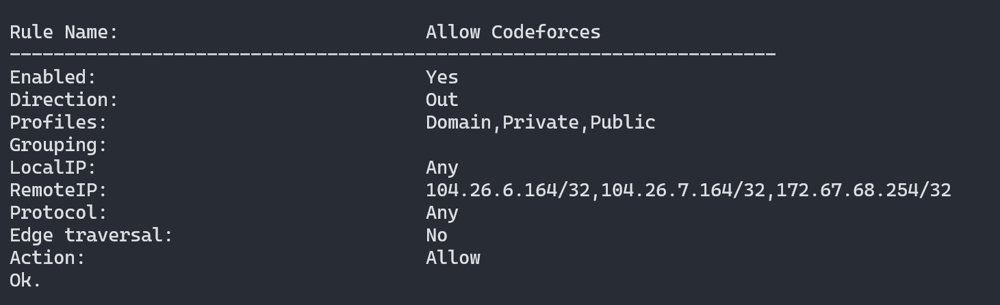

## To block:
netsh advfirewall set allprofiles firewallpolicy blockinbound,blockoutbound

## To allow:
netsh advfirewall set allprofiles firewallpolicy allowinbound,allowoutbound

## To reset:
netsh advfirewall reset

## To show the current settings:
netsh advfirewall show allprofiles

## To show the current settings in a more readable format:
netsh advfirewall show allprofiles | findstr "State"

## IP lookup from DNS:
$ips = (Resolve-DnsName codeforces.com -ErrorAction Stop |
        Where-Object { $_.IPAddress -match '^\d+\.\d+\.\d+\.\d+$' } |
        Select-Object -ExpandProperty IPAddress) -join ','

## Allow only a specific IP address:
netsh advfirewall firewall add rule name="Allow Codeforces" dir=out action=allow protocol=any remoteip=$ips

## To see our rules:

netsh advfirewall firewall show rule name="Allow Codeforces"

<!-- continuously check if the rule is enabled and trigger an alert if not -->
Get-NetFirewallRule -PolicyStore PersistentStore | Where-Object { $_.Enabled -eq $true } | Format-Table -AutoSize
